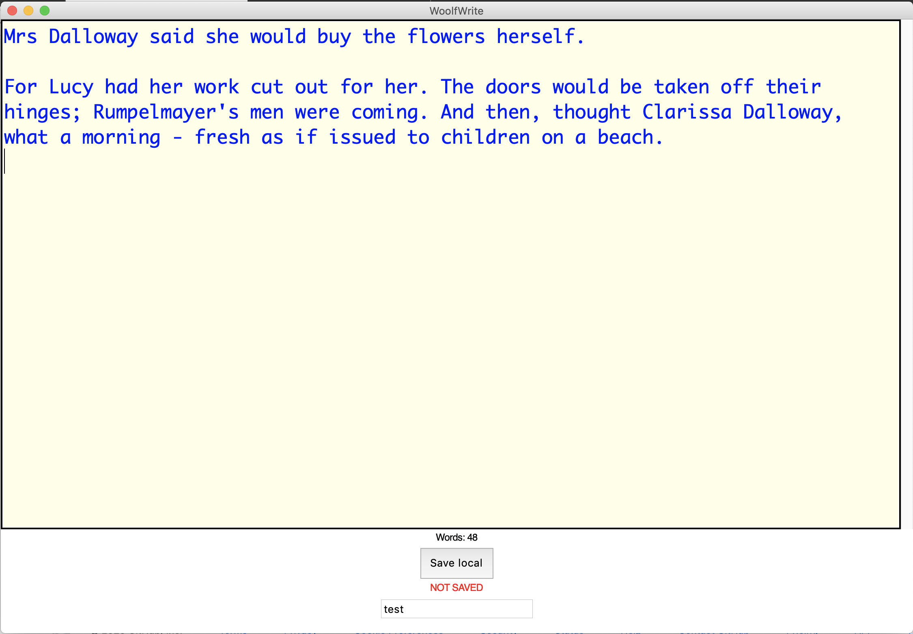

# woolf-write
A simple Python plain text word processor made with guizero

## Why and what now?

The aim was to make a simple distraction-free word processor that is cheaper than buying a FreeWrite. I envisaged it backing up automatically by FTP or something, but actually I just run it in a Dropbox folder so the text gets backed up automatically anwyay if I have internent access.

It really, really bugs me that so many word processors don't, by default, have an on-screen word count. So many people need word counts. You need them for job or college applications. You need them if you're being paid to write. Why no on-screen word counts!? So I decided to find out how hard it was to write my own.

My wife and I have often noticed how different websites and apps give totally different word counts for the same text, and I think I may know why now. Some are not very good. They include things like carriage returns, line feeds and stray spaces and punctuation as words. I think this one is pretty good, but what do you think? Could it be simplified?

I also wanted to experiment with @lawsie's awesome guizero, a Python library that makes getting started with basic GUIs much easier than the dreaded Tkinter.

## How to install

First install guizero, there's a guide here: https://lawsie.github.io/guizero/

Download the woolfWrite.py and test.txt and woolfWrite.cfg config file and run woolfWrite.py, for example from IDLE.

The .cfg file stores the filename of the last saved document. It assumes you're only working on one document at a time.

## How to use

Start typing! The word count updates constantly as you type. It will warn you if your document had changed and not been saved. Click the 'save local' button to save. You can type a new filename in the box at the bottom of the window. Your current filename is also displayed in the app's title bar.

## To do
This must be kept as simple as possible, but...
- add exception handling if .cfg file doesn't exist, create one
- time stamp saved files perhaps to keep every version of your work
- options to change colour scheme?
- use a different font, something proportional perhaps
- possible merge with the rich-text HTML-based word processor I am working on
- test with very long files - does this break the word count?
